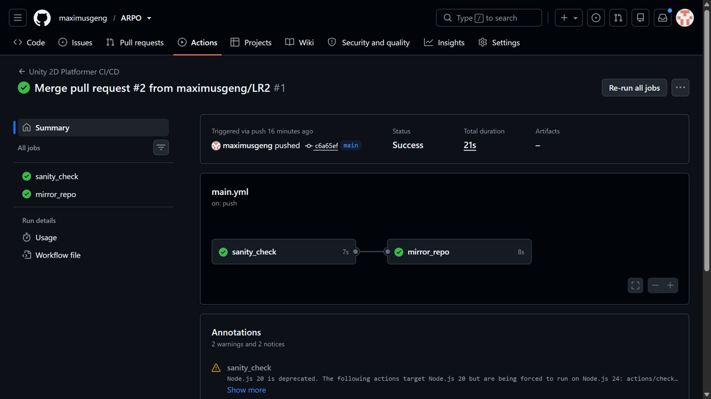
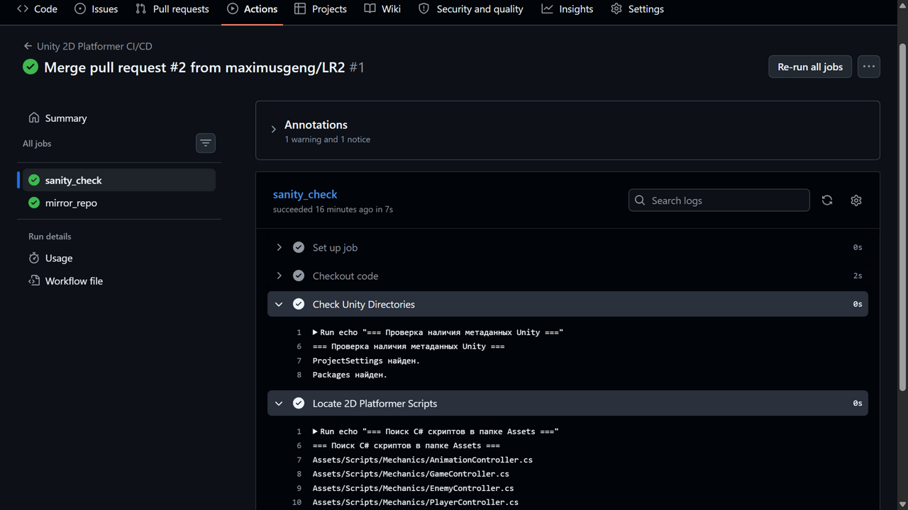
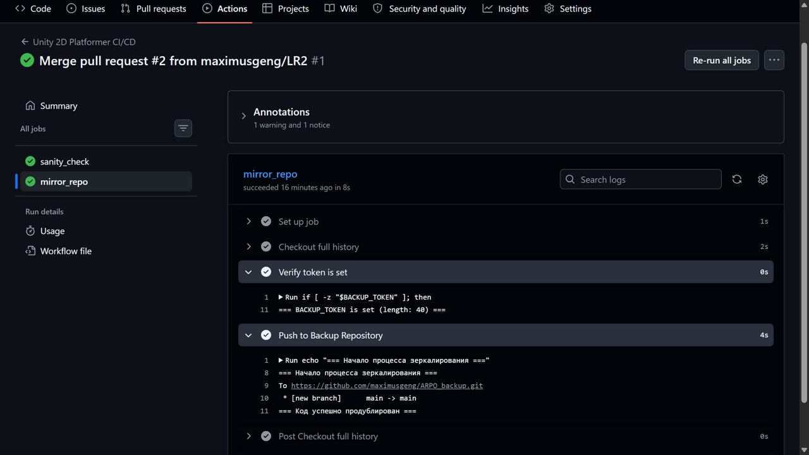
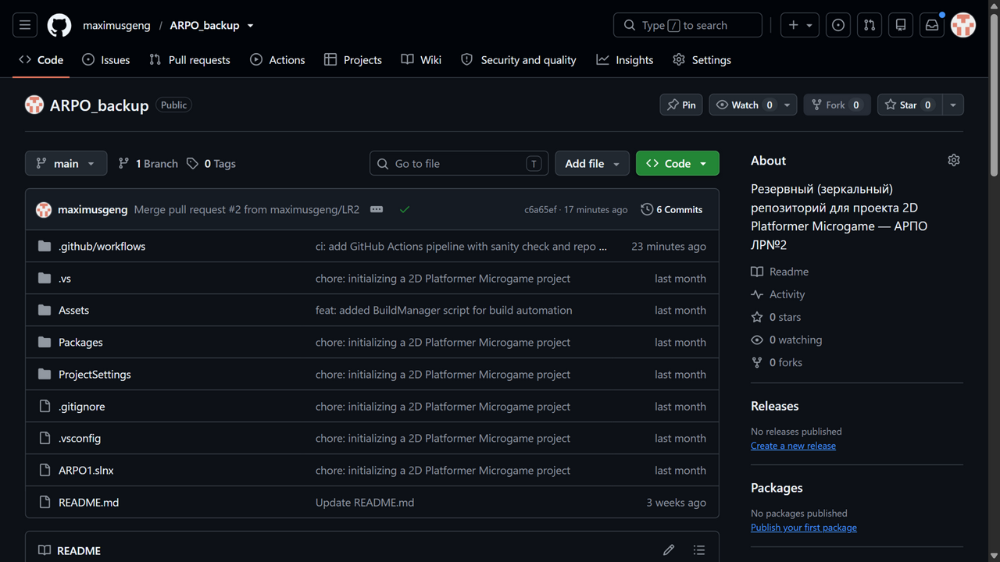
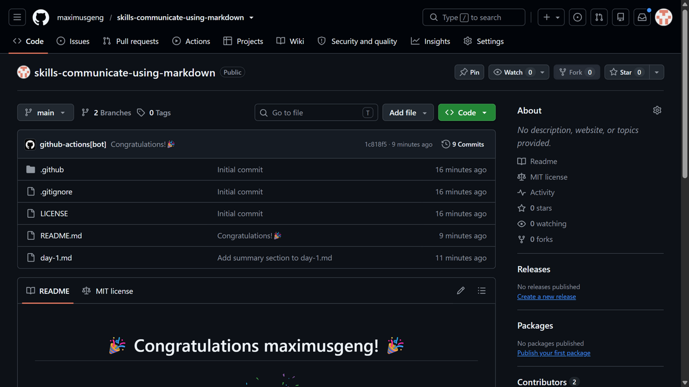
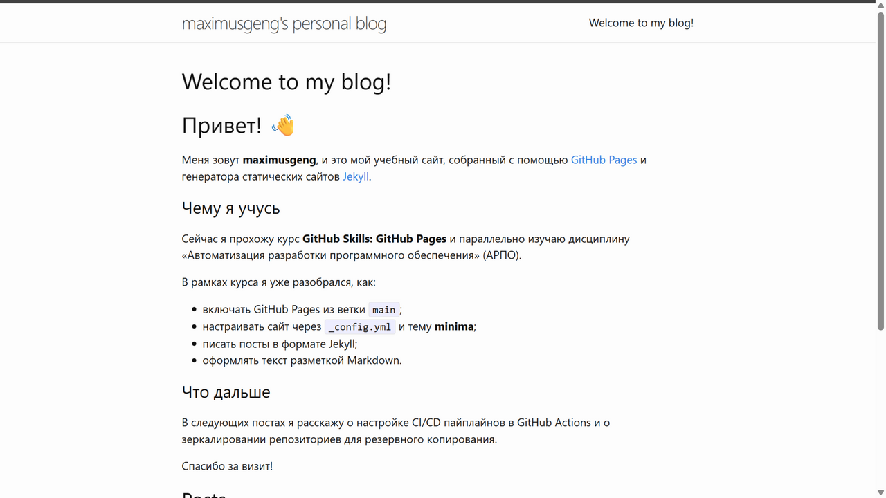
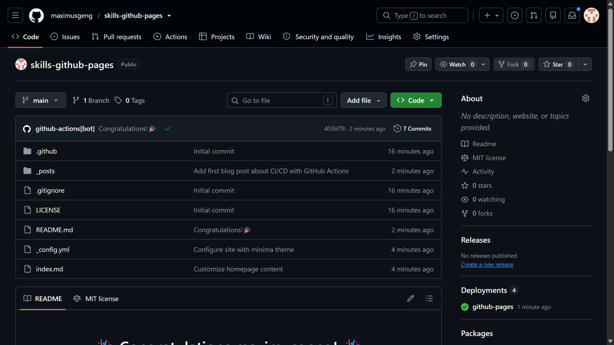

# АРПО — лабораторные работы

Дисциплина: АРПО (Автоматизация разработки программного обеспечения)

Проект: 2D Platformer Microgame (Unity 6000.3.11f1 и выше)

| Работа | Тема | Артефакты |
|---|---|---|
| ЛР№1 | Автоматизация сборки 2D игры через командную строку (CLI) | `Assets/Editor/BuildManager.cs`, `Builds/WebGL/` |
| ЛР№2 | Настройка репозиториев на GitHub и Sanity Check в GitHub Actions | `.github/workflows/main.yml`, репозиторий `ARPO_backup` |

## Структура репозитория

| Путь | Назначение |
|---|---|
| `Assets/Scenes/` | Игровые сцены проекта |
| `Assets/Editor/BuildManager.cs` | Скрипт автоматической сборки WebGL |
| `.github/workflows/main.yml` | Пайплайн CI/CD (Sanity Check + зеркалирование) |
| `docs/lr2/` | Скриншоты выполнения ЛР№2 |
| `Builds/WebGL/` | Выходная папка сборки (в git не попадает) |
| `.gitignore` | Исключения Git для проекта Unity |
| `build_webgl.log` | Лог консольной сборки (в git не попадает) |

---

# Лабораторная работа №1. Автоматизация сборки через CLI

## Как собрать игру из командной строки

PowerShell (путь к Unity.exe подставьте под свою версию):

```powershell
& "C:\Program Files\Unity\Hub\Editor\6000.3.11f1\Editor\Unity.exe" -batchmode -nographics -projectPath . -executeMethod BuildManager.BuildWebGL -quit -logFile build_webgl.log
```

Результат: папка `Builds/WebGL/` с файлами `index.html`, `Build/`, `StreamingAssets/`.
В конце `build_webgl.log` должна быть строка `[CI/CD] УСПЕХ! WebGL билд успешно создан.`

## Как запустить собранную игру локально

Двойной клик по `index.html` не работает (ошибка CORS). Откройте папку
`Builds/WebGL/` в VS Code и запустите расширение **Live Server** (кнопка
*Go Live*) — игра откроется на `http://127.0.0.1:5500`.

## Ход работы ЛР№1 (кратко)

1. **Шаг 1.** Создан проект на базе шаблона 2D Platformer Microgame, сцена добавлена в Build Settings.
2. **Шаг 2.** Создана папка `Assets/Editor/` и скрипт `BuildManager.cs` с методом `BuildWebGL()`.
3. **Шаг 3.** В Publishing Settings отключено сжатие WebGL (Gzip → Disabled).
4. **Шаг 4.** Скрипт скомпилирован без ошибок.
5. **Шаг 5.** Сборка запущена из терминала командой `-batchmode -nographics -executeMethod BuildManager.BuildWebGL -quit -logFile build_webgl.log`.
6. **Шаг 6.** Лог сборки проанализирован: `[CI/CD] УСПЕХ! WebGL билд успешно создан.`, время и размер сборки зафиксированы.
7. **Шаг 7.** Игра запущена через Live Server, загрузка и управление работают.
8. **Шаг 8.** Инициализирован Git, создан `.gitignore`, базовый коммит в `main`, скрипт сборщика закоммичен в ветке `LR1` и отправлен на GitHub.
9. **Шаг 9.** Создан Pull Request `LR1 → main`, получены аппрувы двух рецензентов, PR слит.

---

# Лабораторная работа №2. GitHub Actions: Sanity Check и зеркалирование

**Цель:** изучение принципов построения декларативных сценариев непрерывной
интеграции (CI) на платформе GitHub Actions, автоматизация верификации
структуры проекта (Sanity Check), безопасное управление секретами репозитория
и настройка автоматического зеркалирования кода в резервную инфраструктуру.

## Что делает пайплайн

Файл `.github/workflows/main.yml` содержит два задания (`jobs`):

| Задача | Назначение | Результат |
|---|---|---|
| `sanity_check` | Быстрая диагностика структуры Unity-проекта | Проверяет наличие `ProjectSettings/` и `Packages/`, ищет `*Controller.cs` и `BuildManager.cs` в `Assets/` |
| `mirror_repo` | Автоматическое зеркалирование в резервный репозиторий | Копирует ветку `main` в `maximusgeng/ARPO_backup` вместе с историей коммитов |

Ключевые директивы пайплайна:

- `on: push: branches: [ "main" ]` — триггер: любой push в главную ветку;
- `needs: sanity_check` — задача зеркалирования стартует только после успешной
  проверки структуры проекта;
- `if: github.repository == 'maximusgeng/ARPO'` — защита от циклического
  зеркалирования (в резервном репозитории задача не выполняется);
- `fetch-depth: 0` — выгрузка полной истории коммитов для корректного
  зеркалирования (по умолчанию `actions/checkout` берёт только последний коммит);
- `persist-credentials: false` — отключение штатного credential helper, чтобы
  `GITHUB_TOKEN` не перекрывал PAT из секрета;
- `${{ secrets.BACKUP_TOKEN }}` — токен доступа, хранящийся в Repository Secrets.

## Ход работы ЛР№2 (кратко)

1. **Шаг 1.** Создан второй, пустой репозиторий `ARPO_backup` для зеркалирования.
2. **Шаг 2.** Сгенерирован токен доступа (PAT) со scope `repo` и `workflow`.
3. **Шаг 3.** Токен сохранён в секретах основного проекта под именем `BACKUP_TOKEN`
   (Settings → Secrets and variables → Actions).
4. **Шаг 4.** В корне проекта создана папка `.github/workflows/` и файл `main.yml`
   с двумя задачами — `sanity_check` и `mirror_repo`.
5. **Шаг 5.** Создана ветка `LR2`, открыт Pull Request `LR2 → main`
   ([PR #2](https://github.com/maximusgeng/ARPO/pull/2)) и слит в `main`.
6. **Шаг 6.** Проверены результаты: обе задачи пайплайна завершились успешно,
   резервный репозиторий наполнился кодом и историей коммитов.
7. **Шаг 7.** README дополнен шагами ЛР№2 и скриншотами (этот раздел).

## Результаты

### Запуск пайплайна

Обе задачи — `sanity_check` и `mirror_repo` — завершились с зелёными галочками.
Видна зависимость: `mirror_repo` стартует после `sanity_check`.



### Задача sanity_check

В логе видно фактический результат проверки: каталоги `ProjectSettings`
и `Packages` найдены, а в `Assets/` обнаружены C#-скрипты платформера
(`PlayerController.cs`, `EnemyController.cs`, `GameController.cs` и другие).



### Задача mirror_repo

Токен `BACKUP_TOKEN` прочитан из секретов (длина 40 символов), после чего
выполнен `git push` в резервный репозиторий: `* [new branch] main -> main`.
Итоговая строка лога — `=== Код успешно продублирован ===`.



### Резервный репозиторий

`maximusgeng/ARPO_backup` перестал быть пустым: GitHub Actions полностью
скопировал туда код, структуру папок и историю коммитов (6 коммитов).



## Отличия от методички

Методичка приводит универсальный пример для репозитория `nbrouka/2d_platformer`
с веткой `master`. В данном проекте подставлены актуальные значения:

| В методичке | В проекте |
|---|---|
| `nbrouka/2d_platformer` | `maximusgeng/ARPO` |
| `nbrouka/2d_platformer_backup` | `maximusgeng/ARPO_backup` |
| ветка `master` | ветка `main` |

---

# Задание: курсы GitHub Skills

В рамках задания пройдены три интерактивных курса платформы GitHub Skills.

## 1. Communicate using Markdown

Курс: <https://github.com/skills/communicate-using-markdown>

Создан файл `day-1.md` — учебный пост блога, в котором отработаны заголовки
первого и второго уровня, список задач (task list), блок кода с подсветкой
синтаксиса и изображение в формате HTML с заданными размером и выравниванием.
Работа велась в ветке `start-blog`, затем открыт и слит Pull Request.



## 2. Resolve merge conflicts

Курс: <https://github.com/skills/resolve-merge-conflicts>

Ветки `main` и `my-resume` изменяли один и тот же участок файла `resume.md`
в разделе **Skills**, из-за чего при слиянии возникал конфликт. Конфликт
разрешён ручным объединением обоих изменений, после чего PR был слит.


## 3. GitHub Pages

Курс: <https://github.com/skills/github-pages>

Включён GitHub Pages (источник — ветка `main`), сайт настроен через
`_config.yml` с темой **minima**, оформлена главная страница `index.md`
и создан пост в формате Jekyll — `_posts/2026-10-08-my-first-post.md`.

Опубликованный сайт: <https://maximusgeng.github.io/skills-github-pages/>





---

## История коммитов

```text
git log --oneline --graph --all
```
